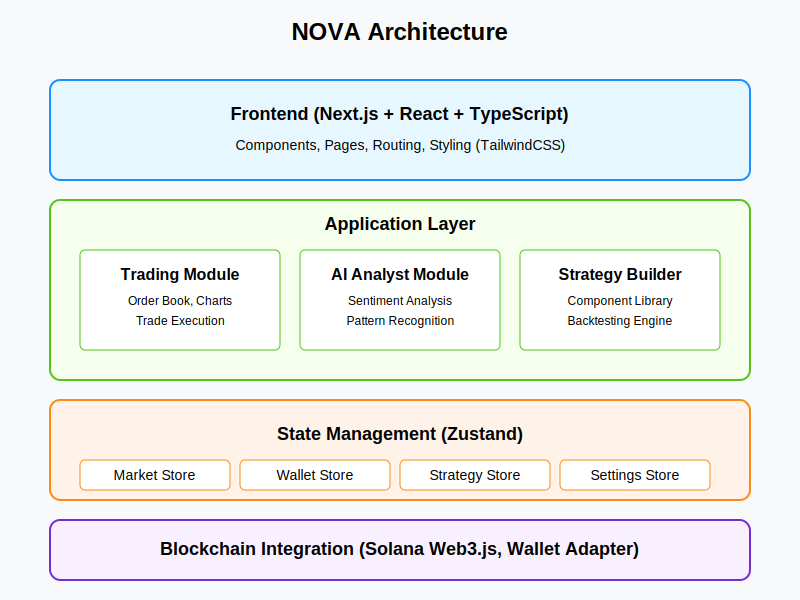
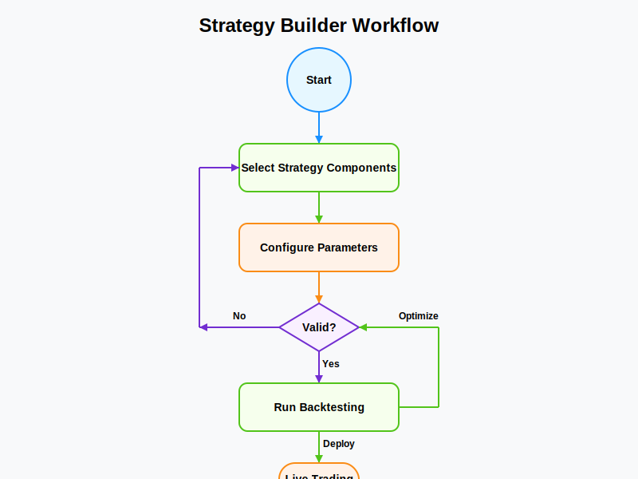

# NOVA - AI Trading Assistant

<div align="center">
  <div style="font-size: 60px;">✨ 🌟 ✨</div>
  
  <br /><br />
  
  <p>Next-generation AI-driven trading assistant on Solana blockchain</p>
  <p>Practical market intelligence, automated trading capabilities, and portfolio management tools for the Solana DeFi ecosystem</p>
  <p><strong>Version: 1.02</strong></p>
  
  <div>
    <a href="https://www.novas.today" target="_blank">Website</a> •
    <a href="https://x.com/NOVA_AIC" target="_blank">Twitter</a> •
    <a href="https://github.com/NOVA-Agent" target="_blank">GitHub</a>
  </div>
  <br />
</div>

## Overview

NOVA is a cutting-edge AI-driven trading assistant built on the Solana blockchain. The platform empowers traders with actionable market intelligence, sophisticated automated trading capabilities, and comprehensive portfolio management tools specifically optimized for the Solana DeFi ecosystem. By leveraging Solana's sub-second finality and negligible fees, NOVA enables traders to execute complex strategies previously available only to institutional investors.

## Architecture

NOVA follows a modular, layered architecture designed for scalability and maintainability:



*(Note: If SVG diagrams don't display correctly, open the SVG files directly in your browser or image editor.)*

### Frontend Layer
- **Next.js App Router**: Page-based routing and server components
- **React Components**: Reusable UI elements organized by feature domain
- **TailwindCSS**: Utility-first styling with custom theme configuration

### Application Layer
- **Feature Modules**: Domain-specific code separation (Trading, AI analysis, Strategy building)
- **Custom Hooks**: Reusable logic for data fetching, local storage, and UI state
- **Utility Functions**: Helper functions for common operations

### State Management
- **Zustand Stores**: Global state management with Redux-like patterns
- **Persistence Layer**: Local storage integration for user preferences
- **Optimistic Updates**: Immediate UI feedback with backend confirmation

### Blockchain Integration
- **Solana Web3.js**: Solana blockchain interaction
- **Wallet Adapter**: Wallet connection and transaction signing
- **DEX Integration**: Liquidity aggregation from Jupiter and other DEXes

## Data Flow

The application's data flow follows clear patterns for predictable state updates:


1. **External Data Sources**:
   - Real-time market data from DEX APIs
   - Blockchain data from Solana RPC nodes
   - News and social data from specialized API providers
   - Historical price data for technical analysis and backtesting

2. **State Management**:
   - Zustand stores maintain global application state
   - Each store has focused responsibilities (market, wallet, strategy, settings)
   - Stores interact through well-defined interfaces

3. **Feature Modules**:
   - Trading terminal integrates order books, charts, and execution
   - AI analyst processes market sentiment, patterns, and correlations
   - Strategy builder combines components into executable trading strategies

4. **User Interface**:
   - Components subscribe to relevant state
   - UI updates reactively to state changes
   - User interactions trigger state mutations

## Key Implementation Details

### State Management with Zustand

```typescript
// Market Store Example (simplified)
export const useMarketStore = create<MarketState>()(
  persist(
    (set, get) => ({
      selectedMarket: 'SOL/USDC',
      tokens: [
        {
          symbol: 'SOL',
          name: 'Solana',
          address: '11111111111111111111111111111111',
          decimals: 9,
          logoURI: '/images/tokens/sol.png',
        },
        // Other tokens...
      ],
      priceData: {},
      orderBook: { bids: [], asks: [] },
      recentTrades: [],
      
      // Actions
      setSelectedMarket: (market) => set({ selectedMarket: market }),
      updateTokens: (tokens) => set({ tokens }),
      updatePrice: (symbol, price, change) => set((state) => ({
        priceData: {
          ...state.priceData,
          [symbol]: { price, change, lastUpdated: new Date() }
        }
      })),
      // Other actions...
    }),
    { name: 'market-storage' }
  )
);
```

### AI Market Analyst Module

The AI Market Analyst module processes multiple data sources to generate actionable insights:

```typescript
// AI Analyst Hook (simplified)
export const useSentimentAnalysis = (symbols: string[] = []) => {
  const [data, setData] = useState<TokenSentiment[]>([]);
  const [isLoading, setIsLoading] = useState(true);
  const [error, setError] = useState<string | null>(null);

  useEffect(() => {
    const fetchSentimentData = async () => {
      setIsLoading(true);
      try {
        // In production, this would fetch from actual API endpoints
        // Currently using mock data for development
        const sentimentData = mockTokenSentimentData
          .filter(item => symbols.length === 0 || symbols.includes(item.symbol));
          
        // Artificial delay to simulate network request
        await new Promise(resolve => setTimeout(resolve, 800));
        
        setData(sentimentData);
        setError(null);
      } catch (err) {
        setError('Failed to fetch sentiment data');
        console.error(err);
      } finally {
        setIsLoading(false);
      }
    };

    fetchSentimentData();
  }, [symbols]);

  return { data, isLoading, error };
};
```

### Strategy Builder Workflow

The Strategy Builder allows users to create custom trading strategies visually:



1. **Component Selection**: Users drag and drop components from the library onto the canvas
2. **Parameter Configuration**: Each component's parameters are configured
3. **Validation**: The system validates the strategy for completeness and logical consistency
4. **Backtesting**: The strategy is run against historical data to evaluate performance
5. **Optimization**: Parameters are refined to improve strategy results
6. **Deployment**: Optimized strategies can be deployed for live trading

```typescript
// Strategy Builder Component Library (simplified)
export const createComponent = (
  type: string,
  name: string,
  description: string,
  properties: Record<string, any> = {}
): Component => ({
  id: v4(),
  type,
  name,
  description,
  ...properties
});

// Component examples
export const indicatorComponents = [
  createComponent(
    'indicator',
    'Moving Average',
    'Calculate average price over a specified period',
    {
      category: 'trend',
      inputs: [
        { name: 'period', type: 'number', default: 14, min: 2, max: 200 },
        { name: 'source', type: 'select', default: 'close', options: ['open', 'high', 'low', 'close', 'hl2', 'hlc3', 'ohlc4'] }
      ],
      outputs: [
        { name: 'ma', type: 'line' }
      ]
    }
  ),
  // More indicator components...
];
```

## Project Structure

```
nova/
├── public/            # Static assets
│   ├── images/        # Images and SVG diagrams
│   │   └── logo.svg       # NOVA logo
│   ├── src/
│   │   ├── app/           # Next.js app router
│   │   │   ├── page.tsx                # Landing page
│   │   │   ├── layout.tsx              # Root layout
│   │   │   ├── trading/                # Trading terminal
│   │   │   ├── ai-analyst/             # AI market analyst
│   │   │   └── strategy-builder/       # Strategy builder
│   │   │   └── components/            # Reusable UI components
│   │   │       ├── Layout.tsx              # Page layout container
│   │   │       ├── nav/                    # Navigation components
│   │   │       ├── solana/                 # Wallet connection and blockchain
│   │   │       ├── strategy/               # Strategy builder components
│   │   │       └── ui/                     # Generic UI components
│   │   ├── modules/       # Feature-specific modules
│   │   │   ├── ai-analyst/
│   │   │   │   ├── types.ts            # Type definitions
│   │   │   │   ├── mockData.ts         # Development mock data
│   │   │   │   └── hooks.ts            # Data fetching hooks
│   │   │   └── strategy-builder/
│   │   │       ├── componentLibrary.ts # Strategy component definitions
│   │   │       └── backtester.ts       # Strategy backtesting engine
│   │   ├── hooks/         # Custom React hooks
│   │   │   ├── useLocalStorage.ts      # Local storage state persistence
│   │   │   ├── useMediaQuery.ts        # Responsive design utilities
│   │   │   └── useMarketData.ts        # Market data fetching
│   │   ├── lib/           # Utility functions and constants
│   │   │   └── utils.ts                # Common utility functions
│   │   ├── store/         # Global state management
│   │   │   ├── useSettingsStore.ts     # User settings state
│   │   │   ├── useMarketStore.ts       # Market data state
│   │   │   ├── useWalletStore.ts       # Wallet connection state
│   │   │   └── useStrategyStore.ts     # Strategy building state
│   │   ├── types/         # TypeScript type definitions
│   │   │   └── common.ts               # Shared type definitions
│   │   └── globals.css    # Global styles
│   ├── styles/            # Global styles and Tailwind config
│   ├── tests/             # Test files
│   └── ...config files    # Configuration files
```

## Key Features

### Trading Terminal
- Multi-DEX dashboard with real-time order book and liquidity visualization
- Unified trading interface with smart routing for optimal execution
- Advanced charting with 50+ technical indicators
- Position management with live P&L tracking
- Customizable price, volume, and indicator alerts

### AI Market Analyst
- Real-time sentiment analysis for 100+ Solana tokens
- Smart money tracking and whale wallet movement detection
- News aggregation with AI-powered impact analysis
- Automatic pattern recognition with success probability scoring
- Cross-token correlation analysis for diversification opportunities

### Strategy Builder
- Visual no-code strategy builder with drag-and-drop interface
- 15+ pre-built strategy templates
- Comprehensive backtesting engine with detailed performance metrics
- AI-assisted parameter optimization
- Automated 24/7 strategy execution

### Portfolio Manager
- Multi-wallet dashboard for unified asset viewing
- Performance analysis with historical P&L
- Tax reporting capabilities
- Automated rebalancing tools
- Risk analysis visualization

### Learning Center & Community
- Strategy marketplace for sharing and selling trading strategies
- Structured educational content
- Strategy leaderboards with performance metrics
- Regular trading competitions with rewards
- Social features to follow successful traders

## Getting Started

### Prerequisites
- Node.js 18+
- Yarn or npm

### Installation

```bash
# Clone the repository
git clone https://github.com/NOVA-Agent/nova.git
cd nova

# Install dependencies
npm install
# or
yarn

# Start the development server
npm run dev
# or
yarn dev
```

Open [http://localhost:3000](http://localhost:3000) in your browser to see the application.

## Technology Stack

- Frontend: Next.js, React, TypeScript, TailwindCSS
- Charts: Lightweight Charts, Chart.js
- State Management: Zustand
- Blockchain Integration: Solana Web3.js, Wallet Adapter
- UI Components: Radix UI
- Animations: Framer Motion

## Contributing

We welcome contributions! Please feel free to submit a Pull Request.

1. Fork the repository
2. Create your feature branch (`git checkout -b feature/amazing-feature`)
3. Commit your changes (`git commit -m 'Add some amazing feature'`)
4. Push to the branch (`git push origin feature/amazing-feature`)
5. Open a Pull Request

## License

This project is licensed under the MIT License - see the LICENSE file for details.

## Contact

- Website: [www.novas.today](https://www.novas.today)
- Twitter: [@NOVA_AIC](https://x.com/NOVA_AIC)
- GitHub: [@NOVA-Agent](https://github.com/NOVA-Agent)

## Acknowledgements

- Solana Foundation
- Jupiter Aggregator
- All contributors and community members 